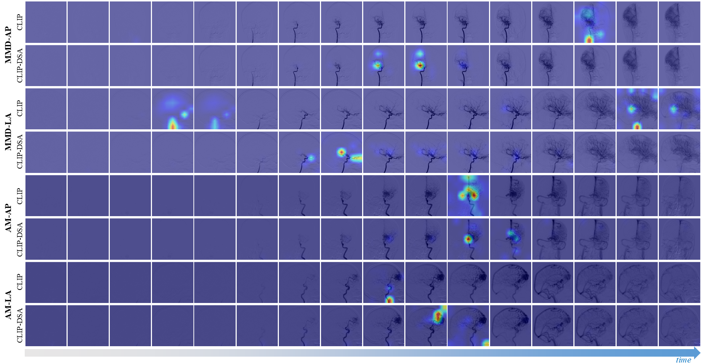
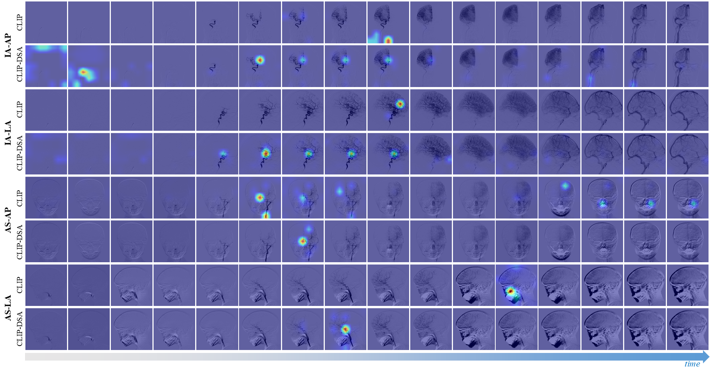

# CLIP-DSA
📢📢📢**CLIP-DSA: Textual Knowledge-Guided Cerebrovascular Diseases Recognition in Multi-View Digital Subtraction Angiography**🧠🧠🧠

**Supplementary Material**

**Fig.1 The GradCAM diagrams of CLIP and CLIP-DSA from AP and LA views, including moyamoya disease and arteriovenous malformation. It can be seen that CLIP-DSA focuses more on the lesion area compared to CLIP.**

****

**Fig.2 The GradCAM diagrams of CLIP and CLIP-DSA from AP and LA views, including Intracranial aneurysm and arterial stenosis. It can be seen that CLIP-DSA focuses more on the lesion area compared to CLIP.**

****
